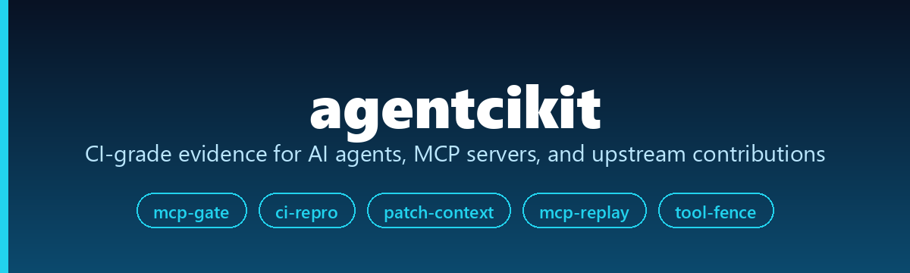
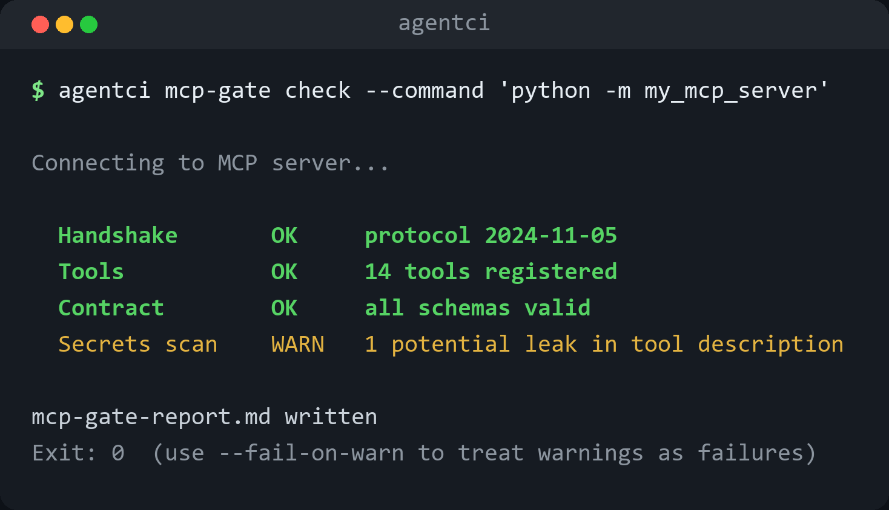

<div align="center">



[](https://pypi.org/project/agentcikit/)
[](https://pypi.org/project/agentcikit/)
[](LICENSE)
[](https://github.com/he-yufeng/agentcikit/actions)

[**安装**](#安装) · [**mcp-gate**](#mcp-gate) · [**ci-repro**](#ci-repro) · [**tool-fence**](#tool-fence) · [English](README.md)

</div>

<p align="center"></p>

面向 AI agent、MCP 服务器和开源贡献工作的「CI 级证据与安全」工具集。

用 AI agent 写代码、维护 MCP 服务器、给上游项目提 PR 时，难的往往不是写出改动，而是**证明改动是对的**：说明一条 CI 失败是真回归而不是噪声、把真正相关的几个文件喂给 agent、把坏掉的 MCP 服务器挡在 `main` 之外、把协议 bug 变成维护者能直接读的 transcript、以及测试 agent 不会因为某段不可信文本就去调危险工具。

`agentcikit` 把五个小而专注的命令行工具打包到一起，每个都产出这类证据、都能干净地接进 CI：

| 子命令 | 作用 |
|---|---|
| `agentci ci-repro` | 把 GitHub Actions 失败日志变成本地复现计划 + PR 证据包。 |
| `agentci patch-context` | 针对一个 issue / 失败测试 / 补丁，构建小而可解释的「该读哪些文件」上下文包。 |
| `agentci mcp-gate` | MCP 服务器的 CI 门禁：握手、列工具、校验工具契约、扫描泄露的密钥。 |
| `agentci mcp-replay` | 把 MCP JSON-RPC 流量录制 / 回放成脱敏、可评审的 fixture。 |
| `agentci tool-fence` | agent 工具调用的确定性安全回归测试，在 CI 里用 fixture 回放。 |

每个工具都能单独用。合起来，它们覆盖了「以可评审证据、而不是截图和『我这边能跑』」来贡献和运维 agent/MCP 项目的整个回路。

## 安装

```bash
pip install agentcikit
```

装好后是一个 `agentci` 命令带五个子命令。`agentci --help` 看总览，`agentci <子命令> --help` 看单个工具。

## ci-repro

把 CI 日志变成分类后的失败报告 + PR 评论草稿。它不是 `act` 那种本地 runner，也不是 `actionlint` 那种 linter；它读你已经有的日志，找到第一条可处理的失败，分类（真回归 / 权限门 / 网络限制 / 依赖安装 / 本地测试失败），并提取一条可能的本地复现命令。

```bash
gh run view 123456789 --repo owner/repo --log > run.log
agentci ci-repro plan run.log --out repro.md
agentci ci-repro comment run.log            # 从第一条失败生成 PR 评论草稿
```

## patch-context

把一个窄任务真正相关的文件喂给 coding agent。它读 issue 文本、堆栈、失败日志、git diff、文件名、内容词，以及轻量的 Python/JS/TS 导入关系，排出 agent 应该先读的文件。整库交接用 Repomix，长期文档用 RepoWiki；任务是「修这个 issue」或「调这个 CI 失败」时用 `patch-context`。

```bash
agentci patch-context scan --repo . --issue issue.md --top 12 > context.md
pytest -q 2>&1 | tee pytest.log
agentci patch-context from-failure --repo . pytest.log --format md
agentci patch-context from-diff --repo . --base main --format json
```

## mcp-gate

别再把坏掉的 MCP 服务器发出去。`mcp-gate` 启动一个 stdio MCP 服务器，跑客户端握手、列工具、校验工具契约形状、扫描可见的元数据和 stderr 里有没有泄露密钥，并写出能接进 GitHub Actions 的 Markdown/JSON 报告。必需检查不过时返回非零退出码，于是 PR 会在坏服务器落地前先失败。

```bash
agentci mcp-gate check \
  --command "python -m your_mcp_server" \
  --report mcp-gate-report.md \
  --json mcp-gate-report.json
```

需要警告也让 CI 失败时加 `--fail-on-warn`。

## mcp-replay

把 MCP JSON-RPC 流量录制 / 回放成小的 JSONL fixture。MCP 服务器坏了时，维护者需要的是消息序列而不是截图：发了哪个请求、回了哪个响应、id 对不对得上、有没有 token 或本地路径泄露。`mcp-replay` 把这些抓下来、脱敏，再用同样的客户端消息回放到服务器上比对响应形状。

```bash
agentci mcp-replay record --command "python -m my_mcp_server" --out transcript.jsonl
agentci mcp-replay inspect transcript.jsonl --format md
agentci mcp-replay redact transcript.jsonl --out transcript.safe.jsonl
agentci mcp-replay replay transcript.safe.jsonl --command "python -m my_mcp_server"
```

## tool-fence

把 agent 工具调用的安全用例放进仓库、在 CI 里跑。它不调用真实模型，而是回放 transcript fixture，检查 agent 会不会调用那些本该被拒绝、本该先确认、或在读到不可信工具输出后该被当作高风险的工具。真实事故往往发生在「答案看起来没问题」之后那一步：agent 读了一个 issue、网页或工具结果，然后调用了危险工具。`tool-fence` 让这条边界测起来很便宜。

```bash
agentci tool-fence init                 # 写出起步 fixture
agentci tool-fence run tests/toolfence --markdown
```

## 相关项目

`agentcikit` 和我维护的另外几个 agent / 开源工具放在一起用：

- [AgentProbe](https://github.com/he-yufeng/AgentProbe) — 回归测试 AI agent 的 pytest 插件（快照、语义比对、mock LLM）。
- [GitSense](https://github.com/he-yufeng/GitSense) — 找可以上手的开源 issue，评估一个仓库的贡献难度。
- [RepoWiki](https://github.com/he-yufeng/RepoWiki) — 给任意代码库生成 wiki 文档。
- [CoreCoder](https://github.com/he-yufeng/CoreCoder) — 一个能从头读到尾的极简 AI coding agent。

## 开发

```bash
git clone https://github.com/he-yufeng/agentcikit
cd agentcikit
pip install -e ".[dev]"
ruff check .
ruff format --check .
pytest
```

## 许可证

MIT
